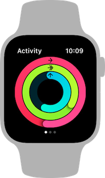
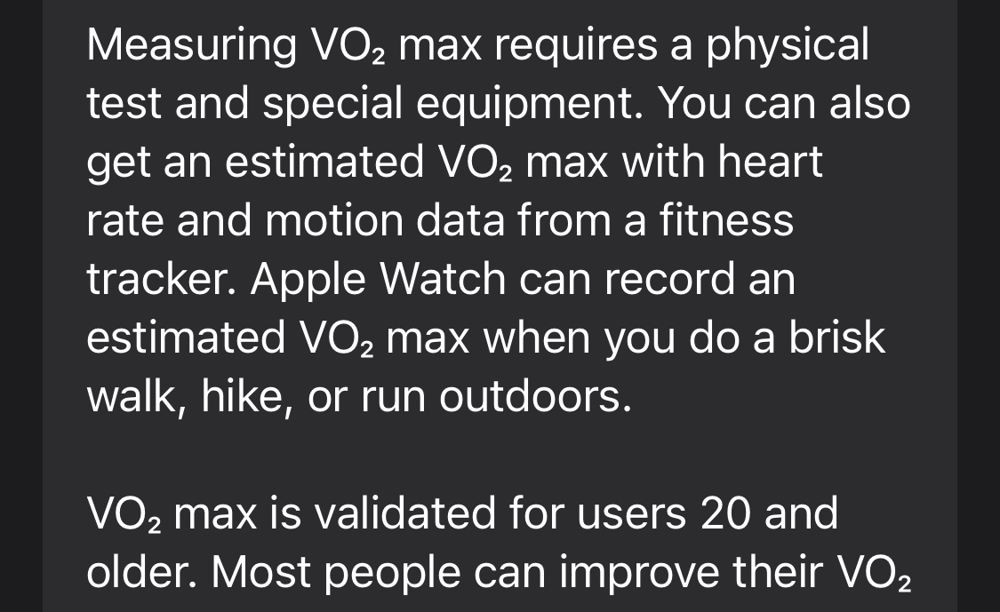
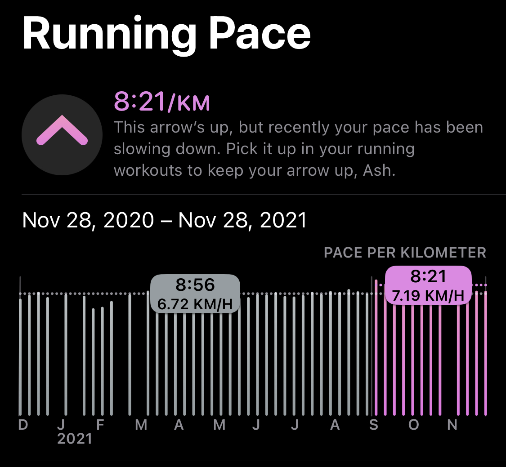
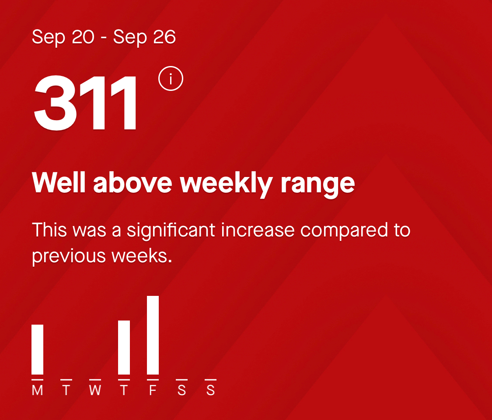
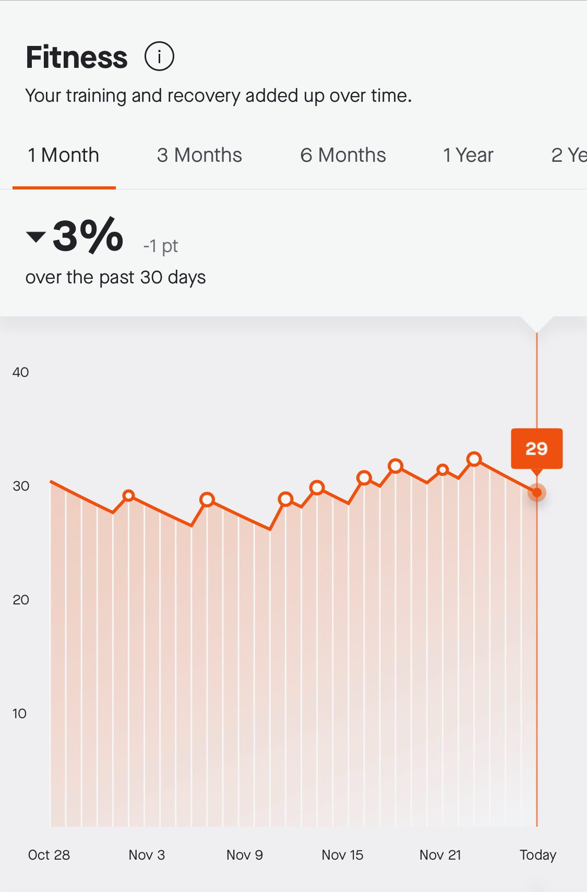

From its initial announcement, [I was skeptical about the Apple Watch](/blog/crestfallen/). But I've tried it now – a few times – and I've been a near-daily user since 2018. It's a great product, whose main appeal to me is activity tracking. Each day, the Apple Watch gives users three goals to meet, represented by rings to close.

<Narrow>

</Narrow>

The goals are:

- Stand and move around for at least one minute per hour, for at least twelve hours per day. (The number of hours per day recently became adjustable.)
- Exercise for at least thirty minutes per day. (This also became recently adjustable.)
- Burn at least a certain number of calories per day. (This has always been adjustable.)

Throughout 2021, I've closed these three rings, every day. I'm proud of that, but I also have some conflicting feelings. At the end of each month, [I would tweet out a screenshot of my month's activity](https://twitter.com/ashfurrow/status/1356044076991320070). Keeping this streak going was motivating to me, but I stopped making these tweets after October. I realized that there were toxic behaviours that I had adopted _because_ of the Apple Watch. A friend who has also filled his three rings every day this year told me something similar. Their streak has been motivating, but it's also been maladaptive.

<Tweet tweetID="1356044076991320070" />

In this blog post, I'm going to break down the toxic aspects of the Apple Watch activity tracking in three broad categories. I'll also show a countering example of how different software succeeds where Apple's Activity app fails. Then I'll let you know what I plan to do in 2022.

Let's dive in.

## Tracking Things is Bad, Actually

What underpins the Apple Watch activity tracking feature is the idea that the Apple Watch can constantly track your activity accurately _and_ that tracking this activity is _per se_ a good idea. But I disagree on both points. Let's examine some counterexamples.

The Apple Watch wants you standing and moving around for at least one minute per hour, twelve hours per day. Seems reasonable, right? If you work at a desk all day, having someone remind you to move around periodically is a good idea.

But what if I need to sleep in? Or have a weekend afternoon nap? If I've been working hard at work but I finally have time to rest, I should rest. What if I'm sick? I should rest, right?

In short order, I found myself putting on my Apple Watch _as soon_ as I got up, just to get an extra hour towards my stand goal. It was a near-obsession. Even when I was over-tired, I would avoid naps because it might disrupt my stand goal. I've seen friends online joke about scheduling naps, for example, from 2:01 — 3:59 just to make sure they get the 2 o'clock and 3 o'clock stand hour credits.

Except I don't think they're joking at all. I think we've all become subservient to our Apple Watches.

Okay, so, fine. Maybe the stand goal is flawed, but that doesn't mean that tracking _per se_ is bad, right? Let's keep going.

Another problem with the watch is how it measures "exercise" based on heart rate. Different people will have different criteria for what heart rate constitutes "exercise", so the Apple Watch uses algorithms to establish an individual baseline to measure from. This algorithm is opaque – you have no visibility or influence on how it works.

I might go for a 30-minute walk with my spouse, and we'll both wear our Apple Watches. We'll both start an "outdoor walk" exercise on our watches. And when we're done, she'll have 30 minutes of exercise and I'll have only two. This is really frustrating.

Let's go further.

The idea that the Apple Watch can accurately track activity is misleading. Its sensors are limited.

- The watch can measure distance travelled on a running activity using GPS, but when I ran my first ever race, 5km long, it only reported 4.2km of distance travelled.
- The heart rate sensor is also not that accurate – I've seen it report heart rates that are well below my resting rate and well above my max rate.
- The "stories climbed on stairs" measurement, based on its barometer, is also not accurate. I've seen the Watch credit me 20 stories during an elevator trip, and I've seen it fail to credit me any stories when running up and down the stairs at home.

These measurements are all only slightly flawed, but these flaws compound when the measurements are combined together to estimate even more complicated metrics. Let's take stride length for example.

The Apple Watch can combine the distance travelled (via GPS) with the accelerometer measurements of my arm swing to calculate my average stride length. But if the GPS isn't accurate, as we saw earlier, then a stride length calculated from it will also be inaccurate.

Stride length is only one example; Apple keeps track of many "measurements" like this one. In my university algorithms class, I learned an important lesson: garbage in, garbage out. You can't build an algorithm that gives accurate output from inaccurate input.

Let's look at a more complicated example: cardiovascular health.

Apple has an algorithm that combines some set of inputs (heart rate and motion sensors) to estimate [V02 Max](https://en.wikipedia.org/wiki/VO2_max), a measure of cardiovascular fitness. A bigger number is better because it indicates how much oxygen your body is able to move from your lungs to your muscles. But I've seen V02 Max estimates from Apple vary wildly for me.

When covid hit and I started wearing a mask outdoors in New York, my V02 Max took a plunge. Makes sense, right? The mask reduced the amount of oxygen I was breathing. And when I moved home to Canada, with its icy sidewalks, my V02 Max took another hit. This also makes sense: I need to move slower, and more carefully, so I have a higher heart rate and a slower walking pace.

The text in iOS also makes this data seem a lot more authoritative than it is, as we saw with the garbage-in-garbage-out problem from earlier. I've come to resent the Activity and Health apps for how accurate and valid they seem to think their data is.

<Narrow>

</Narrow>

The problem here is there is no user input to these algorithms at all. I can't tell my Apple Watch "hey I'm wearing a mask, so don't estimate V02 Max on this exercise." Lack of user input is a larger problem with the Apple Watch Activity tracking. There is no way for users to tell the watch "I'm home sick today" to stop it from pestering the user throughout the day to close their rings.

In fact, the Apple Watch won't ever _not_ tell you to close your rings. This is a crucial mistake because being active, and getting fit specifically, both _require_ rest. Your weight-lifting in the gym isn't what makes your muscles grow, but rather the _rest_ you take the next day is what makes you stronger. You need rest in the form of stretching, walking, and cross-training.

The Apple Watch will never tell you "hey, you've pushed yourself really hard, time to take a break." The Apple Watch will never tell you "you've been standing for twenty hours straight, time for a break." The Apple Watch will only ever push you harder.

So I suppose measuring things _per se_ isn't necessarily bad. But measuring these things isn't necessarily good, either. It all depends on the implementation, and Apple's implementation here leaves a lot to be desired.

## Streaks are Bad, Too

I have some strong opinions against streaks, in general. When first developing a new habit, streaks can be pretty helpful: they incentivize that habit on a regular basis. This is crucial when jump-starting a new habit, whether that's meditating or exercising or whatever.

But after a while, for me, streaks became counter-productive. I would worry so much that my activity was motivated by a fear of breaking my streak rather than enjoying the activity. Once I'm already in the habit of doing something daily, missing a day isn't really a big deal because I'm in the habit already.

The prospect of breaking my streak was really difficult for me to deal with throughout 2021, when I was home sick or dealing with grief. Breaking my streak became yet another thing for me to worry about, and I didn't need that in my life.

Extrinsic goals (goals given to us) are never going to be as motivating or as rewarding as intrinsic goals (goals we give ourselves). In my case, streaks haven't helped me stay active for a while, but they have introduced a new stressor for me. We'll discuss this stressor more next.

## Trends are Worst of All

Trends are probably the worst feature of Apple's Activity app because they combine all of the other problems we've already talked about: imperfect measurements, algorithms to synthesize data from those bad measurements, and a total lack of user input.

I'm sure Apple is well-meaning here, but personally I don't really care if my daily number of exercise minutes has decreased by two over the past month. Like, I literally do not care. And yet Apple's trends feature _wants_ me to care. It admonishes me. It gives me instructions on how to turn my trend around, as if slight fluctuations in activity over time aren't totally normal.

<Narrow>

</Narrow>

There is a ratcheting effect: Activity always wants you to do more, go faster, be better. But humans don't work that way. This sets up maladaptive behaviours. Let's look at an example.

If I start going for evening walks with my spouse, who walks slower than I do, my average walking speed will decrease in the trends section. And there's no way to annotate _why_ that's happening. So even though my average daily walking distance is increasing, and we're both getting more activity, the trends section is telling me that I'm doing something wrong. I might be encouraged to either stop going for evening walks together, or push her to walk faster than is safe (remember: icy Canadian sidewalks).

It just kind of... it sucks, honestly. And this was only one example. But the worst side of trends is how I weaponized them against myself.

If you've never had depression, this might sound bonkers, but I sometimes get in a mood to make myself feed bad. Depression makes me hate myself, and makes me seek out evidence to validate that hatred. All that data the Apple Watch collects? It makes for compelling evidence.

Unfortunately, when I want to make myself hate myself, Apple's Activity app's trends section is where I go.

There is always an arrow that's not pointing up, or is about to start pointing down. The text in trends is trying to encourage me, but it fails to ever validate me. It has no mechanism for me to contextualize this data with annotations.

<Narrow>

</Narrow>

It's that ratcheting effect again: Apple wants you to always, constantly be improving. That is not possible. So what I get is a part of my phone I can doomscroll through all of my failures.

And it's data-backed! So everything in the trends section is _objective_. Perfect for if you're looking for reasons to hate yourself.

This might sound like I'm taking things personally. And I am. But Apple markets the Apple Watch as "their most personal product", so I think I'm entitled to examine it through a personal lens. Since I personally struggle with mental health, I think it's fair to examine the Apple Watch in that light, too.

## Counter-example: Strava

The problems with the Apple Watch can be summarized as follows:

- Imperfect data collection with no user input or even annotation.
- Streaks, which encourage daily use of the Apple Watch product, but don't encourage long-term consistency.
- Algorithms to synthesize estimates based on (incorrect) data, which yield yet more incorrect data.
- Trends, which use all the incorrect data to constantly pursue ratcheting, unattainable goals.

What I've found to help me, instead, is [Strava](https://www.strava.com). I use Strava to keep track of my running, rowing, and cycling workouts. Strava uses the history of my workouts to estimate a "relative effort" score, which it uses to coach me in a sustainable way. Let me explain.

Strava encourages me to maintain a consistent training pace. I can increase my effort week-over-week, but it encourages doing so in reasonable increments. When I go way overboard in a week, Strava tells me so and gently encourages me to focus on consistency. When I have a week where I don't do as much activity in Strava, it tells me that these types of weeks are good for active recovery.

<Narrow>

</Narrow>

This is great – I get actionable advice that matches what I've learned about fitness. A focus on longterm consistency is way more valuable to me than day-to-day streaks. And active recovery is really important for a healthy lifestyle, too.

Strava lets me annotate my activities with structured metadata (like "how difficult did that feel?", "what kind of run was this?", and "what shoes were you wearing?") and unstructured metadata (public and private notes). Reflecting on my workouts is an important part of my practice, so this helps me.

When I go for runs, I often run in the same segment of trail. Strava keeps track of these segments and I can see how my pace changes over time. When I'm trending faster, Strava celebrates that. When I'm trending slower, Strava doesn't draw attention to it. It's a really nice balance.

Strava also uses the relative effort over time to estimate overall fitness, including rest days. And it is explicitly an _estimate_. Compared to the Apple Watch, Strava doesn't claim the same sense of authority on my fitness.

<Narrow>

</Narrow>

The Apple Watch was a great tool for helping me get started with physical activity. When I began taking exercise seriously, daily goals and streaks were really helpful. But now that I've developed those habits and I'm looking for help meeting my own goals, the Apple Watch has failed to grow with me.

Strava, on the other hand, has been a great help as my goals have matured. It does offer extrinsic goals, as well as a social component, but its main selling point (to me) has been how it helps me achieve my own intrinsic goals. This is a huge failing of the Apple Watch, in my opinion.

## So What Now?

The Apple Watch is a sophisticated tool and it can help you accomplish your goals. It helped me accomplish mine. But, if you're not very careful, you will become subordinate to _its_ goals instead. And as we've seen, due to hardware limitations and poor software design choices, it can push users to maladaptive and harmful behaviours.

My friend described the Apple Watch as a relentless taskmaster, which is helpful when helping you _start_ getting active, but which becomes unhelpful when you're trying to _stay_ active. After an entire calendar year of filling my rings each day, I have to agree.

I'm very grateful for the Apple Watch. It helped me get active. But I'm also very disappointed in the Apple Watch, because it has failed to help me stay active in a healthy way (both physically healthy and mentally healthy).

I can't help but wonder how the contrasting business models of the Apple Watch and Strava influence their product designs. Apple wants you using their watch every day, so they've designed their software to incentivize daily use (which serves Apple's goals). Strava wants you to use their product to meet _your own_ goals, so they've designed their software to incentivize... meeting your own goals.

I just need a break from the Apple Watch.

On January 1st, 2022, I have left my watch on the charger to intentionally break my streak.

It's symbolic, but it means something to me. I don't want the pressure of maintaining my longest streak anymore. And if I introduce a little noise into the data, maybe that will help break the spell that the Activity app's trends section has on me. (More helpfully, I'll continue working on this with my therapist.)

Over the years of using the Apple Watch, I've turned off more and more of the Activity notifications. Stand reminders, daily coaching, etc. My next step is to turn off notifications for when I close my rings.

I've spent the past three years building healthy habits, and rebuilding them when they break (eg: covid, recovering from surgery, moving home, etc). I'm not just someone who exercises routinely; I'm someone who starts exercising again whenever they fall off the wagon. Someone who starts themselves because they enjoy moving their body.

I'm ready to stand on my own. The Apple Watch has been instrumental, and I wish it could continue to help me. But if I'm going to continue using the Apple Watch, I'm going to do so in way that puts me in control.
