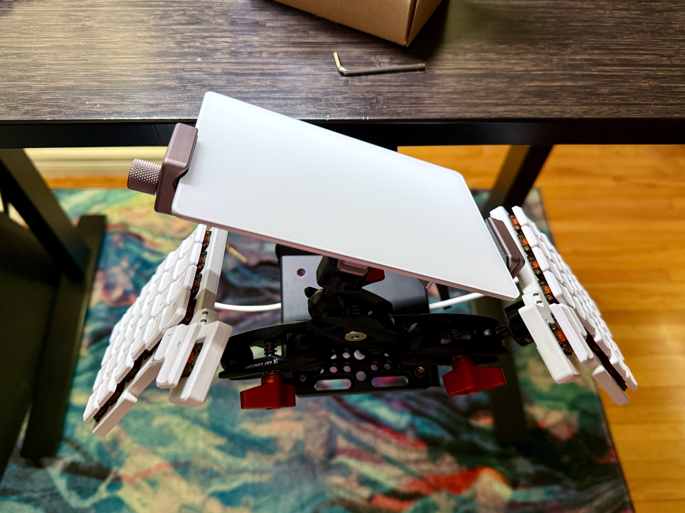

_Content warning: this post contains medical discussions._

Quickly after I began my career as a full-time software developer, I developed pain in my left wrist. At first, it was only occasional. But it became consistent. Then it started showing up in my right wrist.

I wish that I had done something about my wrist pain sooner. And I wish that I had sought professional help sooner, too. Don't worry, though, because the story [has a happy ending](https://ashfurrow.com/blog/learning-to-walk/). It turns out that my posture was the root of my pain. Through exercise, stretching, and physiotherapy, I improved my posture and mostly relieved my pain.

Mostly.

Today, the pain is something I manage. It still flares up, but I now have the tools I need to deal with it. One of those tools has been ergonomics. I've tried wrist splints, better chairs, sit-stand desks, and... ergonomic keyboards.

With keyboards, people often ask about typing speed. And I simply do not care about speed. People online often ask if an ergonomic keyboard will help them type faster, and I doubt it. Maybe! But who cares. My goal is avoiding RSI injuries. For what it's worth, I currently type at around 80wpm. That is fast enough for me.

The biggest takeaway from my experience is: **you should not meet the keyboard, the keyboard should meet you.** If you have to reach for the keyboard, move it closer to you. Everything in the blog post applies this principle in one way or another.

This blog post is about the rabbit hole that I've been falling down in spurts and starts for over a decade. Let's start from the beginning.

# My Journey So Far

In 2015, I bought my first "split keyboard", a [Kinesis Freestyle 2](https://kinesis-ergo.com/shop/freestyle2-mac/) with the "VIP" tenting kit. This is a great keyboard and it remains my go-to recommendation for any programmer who wants a better keyboard. It's basically a "ten key-less" keyboard, with an "inverted T" arrow cluster.

The keyboard is split into two halves. It "tents", which means the two halves are raised in the middle. Both of these are important for ergonomics because it gives you more degrees of control to "bring the keyboard to you." It also has integrated palm rests, which some people prefer (I did at the time). It comes in both Mac and Windows variants, and they've added mechanical switch variants since then too (mine was a membrane keyboard). One downside is that the two halves are connected by a wire that you can't change; the halves can only be 9 inches apart.

But those are small tradeoffs for what you get: an natural posture while typing. Split keyboard solve the most common ergonomic problems while typing:

- **Slouching.** People tend to pull their shoulders into a rounded, forward position to try to meet the keyboard. A split keyboard like this lets you position the two halves so that your chest stays open.
- **Ulnar deviation.** To use both hands at a normal keyboard, you need to kind of bend your wrists out. A split keyboard lets your hands rest naturally while typing.
- **Wrist pronation.** To use a normal keyboard that sits flat on a desk, you need to kind of twist your forearms to flatten your hands. A tented keyboard lets your forearms rest naturally while typing.

There are other issues, too, but these are the common issues. And a split keyboard can help with all of them.

A keyboard should meet you where you are; you should not meet your keyboard.

**Getting a split keyboard is the single best thing you can purchase to improve your ergonomics as a programmer.** Ideally, you are stretching, exercising, and taking movement breaks at work. But if you want to make a change to your workspace _setup_, then getting a split keyboard is the first thing you need to purchase. Everything I discuss in this, from this point forward, offers diminishing returns.

But diminishing returns are still returns.

Back to my journey. At the beginning of the pandemic, I ordered an [ErgoDox EZ](https://ergodox-ez.com/) from ZSA. The ErgoDox EZ is _also_ a split keyboard that _also_ supports tenting, but it has a few distinct features over the Kinesis Freestyle 2. It's a mechanical keyboard with swappable keyswitches. The wire connecting the two halves is a standard TRRS audio cable and can be swapped out for any length of cable you need. The keyboard can be fully programmed, either with firmware code directly or ZSA's fantastic configurator. The ErgoDox EZ also has "thumb clusters" so your thumbs can do more than just hit the spacebar.

But most striking is that it isn't "row staggered" in the way most keyboards are. Instead, it is _column_ staggered. In principle, this means more up-and-down finger movement and less side-to-side finger movement. Less movement is better ("bring the keyboard to you").

I had been looking at it for a while and a coworker had one, so I pulled the trigger. This was my second mechanical keyboard, and I loved it.

The ErgoDox EZ taught me all my mistakes. All the lazy things I was doing, the fingers I was over-using and under-using. I had always been able to type without looking, but the ErgoDox was the first time I practiced touch typing with proper form. It took a few months of practice to totally get used to, but I got it at the beginning of the pandemic so I had some time to kill.

I used the ErgoDox EZ for over four years. I didn't spend too much time customizing it. All the keys were blank, with no legends. Honestly, I didn't use a lot of the keys at all. ([I talk about my ErgoDox EZ setup in more detail in this interview.](https://people.zsa.io/ash-furrow/)) When I joined Float, I got a home-office stipend that I decided to use on [new keycaps](https://drop.com/buy/drop-biip-mt3-extended-custom-keycap-set) for the ErgoDox EZ, which was the beginning of me further customizing my keyboard layout.

_Dang_ that looks so good!

With legends on my keys and colour coding, I had landmarks that I could use to remember the layout more easily. So I expanded my layout. I added print-screen keys, paste-without-formatting keys, and all kinds of one-off keys that made my life a little easier. It was great!

What could go wrong?

The problem I had with the ErgoDox EZ was, ironically, ergnomics. The keyboard tented, but that made the keyboard sit taller on my desk; I had to raise my hands to meet the keyboard. I did use palm rests to help, but that led to another problem.

I take written meeting notes by hand, which means that I use my desk for more than just a keyboard and mouse. Every meeting I would start by pushing my two keyboard halves _and_ their wrist rests _and_ my Magic Trackpad away from me to make room for my notebook. Then at the end of the meeting, I would pull all five pieces back and try to arrange them just-so. A minor frustraiton, but one that persisted for years.

I eventually got lazy and started using my keyboard pushed back, in ways that were uncomfortable. I tried leaving the notebook between the two halves, but that separated them too much. I was back to meeting my keyboard instead of having my keyboard meet me.

Hmm.

Luckily, ZSA came out with a new keyboard last year: [the Voyager](https://www.zsa.io/voyager). This presented a potential solution to my frustration, but would come at the cost of time, money, and becoming an even weirder keyboard person.

I opened my heart to the possibility.

I started playing around with my ErgoDox EZ layout to simulate the Voyager. I added [home row mods](https://precondition.github.io/home-row-mods). I printed out to-scale outlines of both keyboards to compare. I thought really hard about what I wanted, and then [I took the plunge](/blog/new-keyboard/).





This turned out to be a bigger change that I had anticipated.

# The Voyager Keyboard

The Voyager is lower profile. It physically lays flatter on the desk, which solves a minor complain I had about the ErgoDox EZ being too tall. The Voyager tents _a little_, but can also be connected to tripod sockets for maximum tenting flexibility (I am doing a foreshadow here). Lower profile switches travel half the distance as MX switches, and the keycaps are shorter too.

The whole keyboard is very cute and I dig it.

This keyboard has a lot fewer keys that the ErgoDox EZ. That's by design; a great way to minimize finger movement is to use fewer keys. As you have fewer keys, the use of those keys has to get more complex. Remember how the ErgoDox EZ is programmable? The Voyager is too. that programming has some advanced features; as your keyboard gets fewer and fewer keys, you need to use more and more of those advanced features.

The build quality, fit, and finish of the Voyager keyboard are amazing. A huge step up from the ErgoDox EZ, which was already solid. The configuration software is the same, and the customer support from ZSA has been proactive and amazing.

I had always used "clicky" switches on my ErgoDox EZ (Cherry MX Blues) because I liked the sound that my other mechanical keyboard had made. Apparently, lots of people absolutely _hate_ clicky keyboards. I never knew! Because I had never used one in an office. My wife, apparently, enjoys the sound of me tap-tap-tapping away.

Before ordering the Voyager, during a work trip to Toronto, I asked my coworkers to bring in their own keyboards so I could try out some other key switches. I didn't find anything that I liked better than my Cherry MX Blues. So when I ordered my Voyager, I ordered it with the clicky switches (Kailh Choc V1 Whites).

I didn't really like them.

The Kailh White switches felt bad to type on. Their click wasn't satisfying like the Cherry MX Blues. They felt kind of "scratchy". And most worst of all, they sometimes actuated before the click. Apparently, I rest my fingers on keyboards a little too forcefully, and I would often get inadvertently-typed J, K, and L characters (home row on my dominant right hand).

I looked around and tried the best two options I could find: [Ambient Nocturnals](https://lowprokb.ca/products/ambients-silent-choc-switches) and [Sunsets](https://lowprokb.ca/products/sunset-tactile-choc-switches).

Oh my goodness do the Sunsets feel nice. Still a little scratchy, but they feel very satisfying. And they still make enough noise for me. I didn't _like_ the Nocturnals because they were too easy to press down (lightweight springs) but I was downright _disturbed_ by how quiet they were. The Sunsets both feel and sound good to me (my wife also approves of their sound)

The worst part is, when I get out my ErgoDox, I don't even like the Cherry MX Blues anymore. Too clicky. I think I'm just a tactile switch person.

It took a while to get the layout right. I'm actually putting together a tour of my layout right now, which will go into more details. I'll update this post once it's ready. Here's the latest layout:

	<iframe src="https://configure.zsa.io/embed/voyager/layouts/6yzNl/latest/0" style="border: 0; height: 100%; left: 0; position: absolute; top: 0; width: 100%"></iframe>

A few things that make this layout work well for me:

- **Thumb cluster buttons are all single-use keys.** I don't like doubling up on layer mod keys because it introduces a `delaysContentTouches`-esque delay that I find distracting.
- I like home row mods but couldn't get it working for me with Shift. **So I put Shift on a thumb cluster**, which seems to "make sense" to my brain as it sits with the other layer mods, and shift is more a layer mod than OS modifier like command. I would imagine that [Achordion](https://getreuer.info/posts/keyboards/achordion/index.html) could help me here, but I've already settled on a solution for me.
- **I have no Enter key.** I kept prematurely sending Slack messages by accident when I reached for a key and accidentally hit enter. So instead, I created a combo where I hit J and K and the same time (my two strongest fingers on my dominant hand) and that sends Enter. Hard to do by accident, and very satisfying.
- **Optimize for text editing in macOS**, with keys for common actions like "forward delete the next word" and "move to the end of this line." It's all systematized and easy to remember.
- **[Cat Mode](https://tenforward.social/@ashfurrow/113160750825678795).**

<iframe
  src="https://tenforward.social/@ashfurrow/113160750825678795/embed"
  class="mastodon-embed"
  style="max-width: 100%; border: 0; margin-bottom: 50px"
  width="600"
  height="600"
  u
  allowfullscreen="allowfullscreen"
></iframe>

# Tenting Iterations

All of this has been preamble. Table-setting. Context you need to understand: I am in deep.

I have fallen down a rabbit hole. I'm desperately trying to stop myself. My fingers – dug into the sides of this hole – can just barely slow my descent. But the deeper I fall, the less I really want to stop.





I've become a full-on weird keyboard person. Sure, I was using a split keyboard for a decade. And sure, I used a columnar stagger custom-programmable keyboard for years.

But this is another level.

My attempts to bring my keyboard to meet me have led me to their inevitable conclusion. Let's start with the keyboard tray.

After getting the Voyager, I used it on my desk for a while. But it had the same issue where I was always pushing it back for meetings and having to re-arrange the two halves and my trackpad all the time. I thought, let's get a keyboard tray. You know, like the 1990's? A sliding tray that attaches under my desk.

This worked. My keyboard and notebook could both be directly in front of me because they were on different levels. A combination of adjustments to my sit-stand desk and VESA-mounted monitor could accommodate writing and typing, either when sitting or standing. But I had to settle for the limited tenting that the Voyager supports out-of-the-box, which wasn't enough for me.

Also, I had to pull out the keyboard tray any time I wanted to use the keyboard briefly during meetings – which turns out is a lot! The keyboard tray is noisy, too, and very distinct. Not a pleasant sound.

So from there, I explored tenting options using tripod mounts.

You can mount any _thing_ in any _way_ that you want, _if_ you can get it attached to a tripod mount. Photography, videography, DJ'ing, and many other fields have all settled on using this same mount size, so you can use tools from any of those fields. I settled on double-ball joint "magic arms", a miniature tripod that has mounting points at its centre and on its legs, and a tablet holder for my trackpad. It ended up looking like this.

The trackpad is so close to my hand that moving between the keyboard and mouse takes very little movement. It also forces me to "hover type" instead of resting any part of my palms/wrist/forearms on the desk. This prevents nerves from getting pinched. Until-and-unless ZSA commercializes [this DIY trackpad attachment](https://blog.zsa.io/diy-voyager-trackpad-saucer/), I plan to use the Apple Trackpad like this.

I'm so sorry.

I shared this on the `#keyboards` channel at work and got a response that sums it up: "with all due respect this is insane. I respect your journey though."

I _also_ think this is insane. But I also have to respect my own journey.

This setup with the mini tripod worked really well, mainly because it "collapsed" the two keyboard halves and trackpad into a single "thing" that I could move around on my desk. We went from five separate objects to move around down to one. It was easy to switch between note-taking and typing, yay! I used it for a few weeks before playing with a new idea...

What if I could combine the benefits of the keyboard tray with the layout I had from the tripod? I hadn't want to clamp my keyboard to my desk ([which is a common solution](https://www.youtube.com/watch?v=mT3TToFqqEU)) because the clamps would get in the way of my notebook for taking notes.

Then I realized: I already _had_ an unused keyboard tray still attached to my desk, so maybe I could attach everything to that?

Yes.

**_Yes._**

I removed the tray itself but kept the metal slide attached to the bottom of my desk. I then drilled out the existing holes to fit a tripod screw, and added a few new holes.





That allowed me to mount a cheeseplate to the keyboard tray slide.





From there, the rest was just iterating until I found something that worked.

I have so much flexibility. I use the magic arms to position the keyboard and trackpad wherever I want relative to each other. I can still adjust the keyboard tray mechanism, which makes it easy to position the entire keyboard/trackpad contraption at once, relative to my desk. My notebook is unobstructed by my keyboard, so I never have to pull a tray towards me.

This took hours and hours of research and iteration, and took many attempts. As an engineering problem, getting the "best" ergonomic setup was a fun challenge. Intrinsically rewarding, if socially isolating.





This feels amazing to type on and use day-to-day. But I also feel like an idiot. A massive idiot.

I spent time, attention, and money to do _this_ to my home office.

Look at this. I took a perfectly good desk and I gave it anxiety.

I love this, though. It is so comfortable to type on. It meets me where I'm at. It solves all the problems I have. It's the ideal tradeoff, the "best" solution that I could engineer.

---

I'm not quite sure how to end this blog post, because I'm not entirely sure that this _is_ the end. I hope so, at least for a while.

I've been using computers nearly my whole life. I have built a career using computers. But they have taken a toll on my body that I need to manage, or else. I don't want to stop using them, so I have to use them responsibly.

What I'm trying to say really is: if using a weird keyboard makes me not cool, then I don't _want_ to be cool.

I'll settle for no wrist pain.
