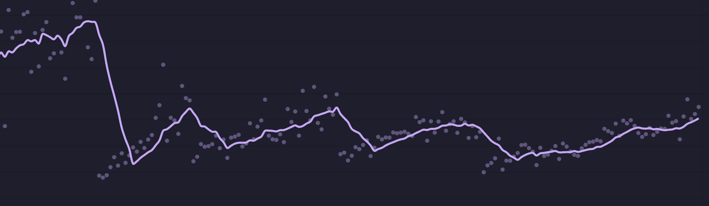

My [keyboard rabbit hole](/blog/keyboard-rabbit-hole/) has inevitably brought me to the world of alternate keyboard layouts. While I briefly used Dvorak in university, I was using too many different computers to make it really stick for me.

I had on heard of [Colemak](https://colemak.com/) from [Christian Selig's keyboard video](https://www.youtube.com/watch?v=7UXsD7nSfDY) less than a year ago. It sounded great – a much better design than Dvorak that used QWERTY as a base. A lot of the keys don't actually change, and only two change which hand you use. I kept hearing how comfortable and fun it was to use Colemak, but I wasn't too keen to give up a lifetime of QWERTY muscle memory while having to type at my job.

That changed when a coworker of mine made the switch to Colemak using [Tarmak](https://dreymar.colemak.org/tarmak-steps.html). Tarmak starts at QWERTY and makes thoughtful, small changes over time to gradually move toward full Colemak. Typing speed goes down, but not as dramatically as a cold-turkey switch.

Well. Alright fine. Let's go.

It's been a month and things are going really well.

Every time I've made a change to the layout, my typing speed has deceased to about the same level (unless you are my boss, in which case my typing speed was unchanged and I am as productive as ever). But with each change, it's taken me longer to get to the point where I feel ready to make the next change. Throw in a week where I was travelling for work and couldn't practice as much, and things are going slowly.

I am on the last step, which is where my coworker rushed things and regretted it. I benefit from his experience of rushing at the end, knowing that rushing would defeat the purpose of making small changes.

I've decided to take an extra week before moving on. I only make the layout changes on Friday so I can practice over the weekend, so I'll look forward to making that final change in just five days!

One under-rated benefit of using Tarmak is that I've gotten to appreciate the thoughtfulness of Colemak on a deeper level. While I have been frustrated during this transitionary period, I can feel the fun and comfort of using Colemak that I had heard so much about.

The steps I've taken are [here](https://configure.zsa.io/my_layout/view/bVg75) if you're interested. I'm migrating to the Colemak-DH variant specifically, and would recommend it particularly if you're using a columnar-staggered keyboard.
