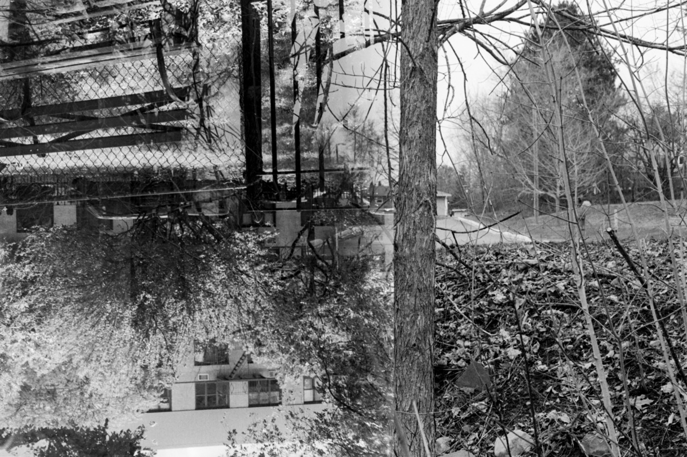
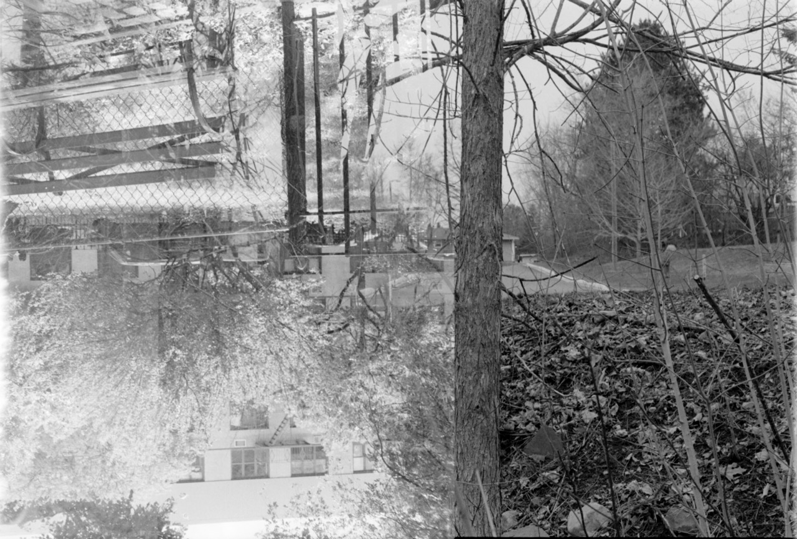

Today marks five years since my wife and I moved away from New York and back to New Brunswick. [When I wrote about this last time](/blog/four-years-in-new-brunswick/), I seemed unhappy. I guess things hadn't worked out the way that I had envisioned them when we moved home – even if I didn't have a really clear vision for how things would go. I have a more optimistic view now.

About a year ago, [I started taking photos again](https://photos.ashfurrow.com/downtown-in-the-rain). It started on my phone, but then I got out my old film cameras which _still had film in them from New York_. I finished the rolls and sent them off to be developed. When they came back, I found this:





This is a double exposuree, with half the frame being taken in New York and the other half being taken here in Fredericton. _Five years apart!_ From what I can piece together, what happened is:

1. I took a photo in New York.
2. Five years pass.
3. At some point, the "double exposure" lever on my camera was activated.
4. I advanced only halfway to the next frame.
5. I took another photo in Fredericton.

That's what I've pieced together, because this was not what I intended when I took either photo. One of the last photos I took in New York, and one of the first photos I took in Fredericton. _This was not what I envisioned._ (I also have _no idea_ why one of the photos was taken _upside down!_ What!?)

Something I love about film photography – and digital, too – is the unexpected. In photography, you see a scene and you pre-visualize the shot, and then you try to realize your photographic vision. But unexpected things happen. And I think _good_ photographers are open to that spontaneity. You can't always faithfully execute on your vision, but you can choose to work with whatever happens.

In this case, I've _edited_ the photo to look good. Without those edits, the original was kind of bleh:





This is not what I envisioned, but I love what I made of it. This is probably my favourite photo that I've ever taken _ever_, and it was an accident.

Things haven't gone the way I intended when I moved home, but that's okay. Part of being human is accepting the spontaneity of life and making something beautiful with it.
