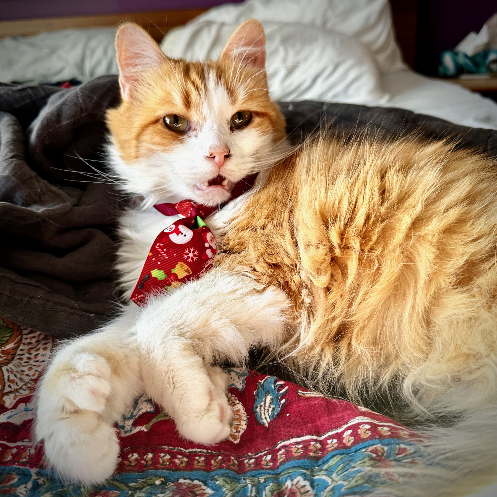
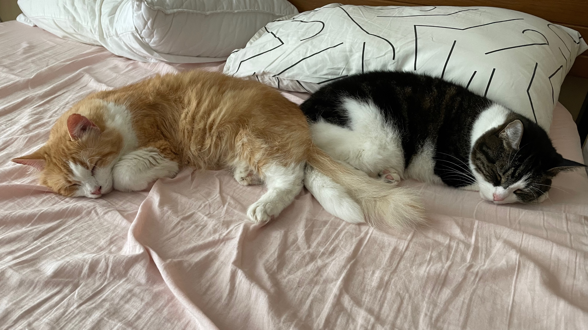
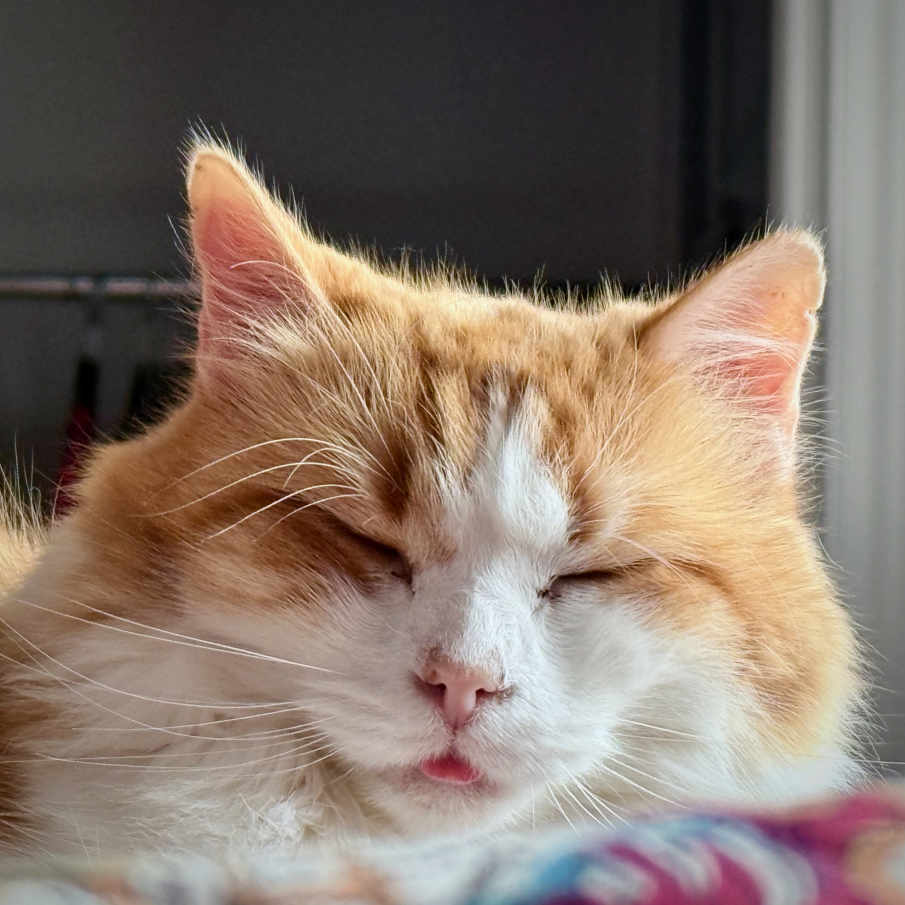

My wife and I said goodbye to our cat Clementine today. We had her for just four years – our time was cut short by cancer. Things have been up and down for months, but at the start of the year we changed priorities to keep her comfortable.





Clementine and her kittens were rescued from an abusive home by a local animal shelter. For the next nine months, her kittens were slowly adopted. But no one wanted to take Clem home until we found her.

I've had pets all my life and I'm very good with cats, but had never cared for an abused animal before. We took things slow. It wasn't long at all until Clem came out of her shell. She never entirely shook off her experiences before the shelter, but she also came into her own here. She found her voice. She even made friends with our grumpy elder cat Bandita. She adored being pet and she had so much love to give.





I'm taking this pretty hard. It feels so unfair. We had so many plans.

But I'm also so grateful to have had the time we did have together. Clem came into our life right before a lot of things went very sideways. I'm still recovering from some of those experiences; Clem showed me what it can look like to grow past and grow with your trauma. My wife picked Clementine because she believed that I could take good care of her, and she was right. But Clem took care of me, too.





Clementine. _Ms. Clem_. We love you and miss you. We'll never forget you. Thank you.
